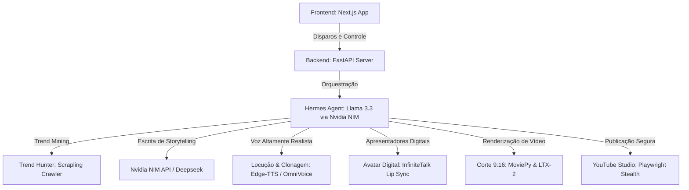

# DEZAFIRA — Fábrica de Canais Autônoma
> **Automação Global & Foco em Monetização**

Dezafira é uma plataforma de ponta a ponta para criação, otimização e publicação automática e recorrente de vídeos verticais (Shorts/TikTok) focada em monetização acelerada. A arquitetura integra orquestração inteligente por IA, clonagem de voz e avatares digitais hiper-realistas.

---

## 🏗️ Arquitetura do Sistema



### 1. Frontend (Next.js Dashboard)
* **Layout Ultrawide de 3 Colunas**:
  * **Coluna 1 (Gestão de Canais)**: Cadastro de múltiplos canais por idioma (PT, EN, ES) com réguas de progresso de monetização dinâmicas e o monitor de ideias virais do *Trend Hunter*.
  * **Coluna 2 (Hermes Monitor & Chat)**: Chat interativo com o Hermes Agent rodando no modo **Mãos Livres** e a linha de tempo do progresso das esteiras.
  * **Coluna 3 (Gestão & Disparo)**: Painel de controle de disparo rápido, ativação do **Piloto Automático** neon com frequência ajustável (diário/alternado) e botão de **Conexão Manual de Canais** (YouTube Studio).

### 2. Backend (FastAPI Engine)
* **Scrapling Agent**: Garimpa tendências reais de alta busca e CPM do YouTube.
* **Brain Agent (Nvidia NIM)**: Gera títulos de tensão emocional e roteiros originais contra a diretriz de "conteúdo repetitivo".
* **Voice cloning & Lip Sync**: Base de dublagem e sincronização de avatares baseada em *OmniVoice* e *InfiniteTalk*.
* **Playwright Stealth**: Realiza o login interativo por canal e o upload seguro de forma 100% autônoma.

---

## 🛠️ Tecnologias e Dependências

* **Frontend**: Next.js 15, React 19, Tailwind CSS.
* **Backend**: FastAPI (Python), Playwright, Edge-TTS, Uvicorn.
* **Inteligência Artificial**: Nvidia NIM API (Llama 3.3 70B Instruct), Deepseek API (redundância).

---

## 🚀 Como Rodar Localmente

### 1. Requisitos
* Node.js v18+ e npm.
* Python v3.10+.

### 2. Rodar o Backend FastAPI
1. Entre na pasta do backend:
   ```bash
   cd SniperVideoEngine
   ```
2. Crie e ative um ambiente virtual e instale as dependências:
   ```bash
   python -m venv venv
   source venv/bin/activate  # No Windows: venv\Scripts\activate
   pip install -r requirements.txt
   ```
3. Configure o arquivo `.env` com a sua `NVIDIA_API_KEY` e `DEEPSEEK_API_KEY`.
4. Inicie o servidor:
   ```bash
   python server.py
   ```
   *(A API rodará em http://localhost:8000)*

### 3. Rodar o Frontend Next.js
1. Entre na pasta do frontend:
   ```bash
   cd open-generative-ai
   ```
2. Instale as dependências:
   ```bash
   npm install
   ```
3. Compile e rode em produção local:
   ```bash
   npm run build
   npm run start -- -p 3001
   ```
   *(Abra o painel em http://localhost:3001)*

---

## 📈 Próxima Etapa: Deploy & Infraestrutura Nuvem
Para o deploy de produção da **Dezafira** no Railway com o domínio `dezafira.com.br`, a arquitetura local será migrada para:
* **Banco de Dados**: PostgreSQL (armazenando canais e logs persistentes).
* **Fila de Mensagens / Cache**: Redis (gerenciando a fila de processamento assíncrono dos vídeos).
