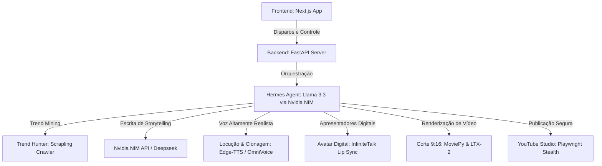

<<<<<<< HEAD
# DEZAFIRA — Fábrica de Canais Autônoma
> **Automação Global & Foco em Monetização**

Dezafira é uma plataforma de ponta a ponta para criação, otimização e publicação automática e recorrente de vídeos verticais (Shorts/TikTok) focada em monetização acelerada. A arquitetura integra orquestração inteligente por IA, clonagem de voz e avatares digitais hiper-realistas.

---

## 🏗️ Arquitetura do Sistema



### 1. Frontend (Next.js Dashboard)
* **Layout Ultrawide de 3 Colunas**:
  * **Coluna 1 (Gestão de Canais)**: Cadastro de múltiplos canais por idioma (PT, EN, ES) com réguas de progresso de monetização dinâmicas e o monitor de ideias virais do *Trend Hunter*.
  * **Coluna 2 (Hermes Monitor & Chat)**: Chat interativo com o Hermes Agent rodando no modo **Mãos Livres** e a linha de tempo do progresso das esteiras.
  * **Coluna 3 (Gestão & Disparo)**: Painel de controle de disparo rápido, ativação do **Piloto Automático** neon com frequência ajustável (diário/alternado) e botão de **Conexão Manual de Canais** (YouTube Studio).

### 2. Backend (FastAPI Engine)
* **Scrapling Agent**: Garimpa tendências reais de alta busca e CPM do YouTube.
* **Brain Agent (Nvidia NIM)**: Gera títulos de tensão emocional e roteiros originais contra a diretriz de "conteúdo repetitivo".
* **Voice cloning & Lip Sync**: Base de dublagem e sincronização de avatares baseada em *OmniVoice* e *InfiniteTalk*.
* **Playwright Stealth**: Realiza o login interativo por canal e o upload seguro de forma 100% autônoma.

---

## 🛠️ Tecnologias e Dependências

* **Frontend**: Next.js 15, React 19, Tailwind CSS.
* **Backend**: FastAPI (Python), Playwright, Edge-TTS, Uvicorn.
* **Inteligência Artificial**: Nvidia NIM API (Llama 3.3 70B Instruct), Deepseek API (redundância).

---

## 🚀 Como Rodar Localmente

### 1. Requisitos
* Node.js v18+ e npm.
* Python v3.10+.

### 2. Rodar o Backend FastAPI
1. Entre na pasta do backend:
   ```bash
   cd SniperVideoEngine
   ```
2. Crie e ative um ambiente virtual e instale as dependências:
   ```bash
   python -m venv venv
   source venv/bin/activate  # No Windows: venv\Scripts\activate
   pip install -r requirements.txt
   ```
3. Configure o arquivo `.env` com a sua `NVIDIA_API_KEY` e `DEEPSEEK_API_KEY`.
4. Inicie o servidor:
   ```bash
   python server.py
   ```
   *(A API rodará em http://localhost:8000)*

### 3. Rodar o Frontend Next.js
1. Entre na pasta do frontend:
   ```bash
   cd open-generative-ai
   ```
2. Instale as dependências:
   ```bash
   npm install
   ```
3. Compile e rode em produção local:
   ```bash
   npm run build
   npm run start -- -p 3001
   ```
   *(Abra o painel em http://localhost:3001)*

---

## 📈 Próxima Etapa: Deploy & Infraestrutura Nuvem
Para o deploy de produção da **Dezafira** no Railway com o domínio `dezafira.com.br`, a arquitetura local será migrada para:
* **Banco de Dados**: PostgreSQL (armazenando canais e logs persistentes).
* **Fila de Mensagens / Cache**: Redis (gerenciando a fila de processamento assíncrono dos vídeos).
=======
# 1Crypten 7.0 — Elite Trading System

**Estado**: OPERACIONAL (producao OKX + sandbox)
**Ultima atualizacao**: 2026-06-24

---

## Quick Start

### Requisitos
- Python 3.12+
- Node.js 18+
- Credenciais OKX (com permissoes de trading)

### Setup Local
```bash
# 1. Clonar repositorio
git clone https://github.com/JonatasOliveira1983/1C-7.0.git
cd 1C-7.0

# 2. Instalar dependencias
pip install -r backend/requirements.txt
npm install --prefix frontend

# 3. Configurar ambiente
cp .env.example .env
# Editar .env com credenciais OKX

# 4. Iniciar backend
python main.py

# 5. Backend serve frontend em http://localhost:8085
```

### Login
- **URL**: http://localhost:8085
- **Usuario padrao**: `admin` / `admin123`

---

## Arquitetura

### Modelo Dual-Execution
- **Sandbox**: Todos os sinais simulados para analise estatistica
- **Real**: Sinais aprovados executados na OKX com trading real
- **Ambos rodam simultaneamente** com gestao de risco identica

### Fluxo de Sinal
```
Sinal Gerado
    ↓
CaptainAgent (Quality Gate)
    ↓
Filtro de Regime
    ├─→ LATERAL (ADX < 25)? Apenas DECOR SHADOW
    └─→ TENDENCIA (ADX >= 25)? VELOCITY FLOW + ALPHA SHIELD
    ↓
BankrollManager (Capacidade)
    ├─→ Sandbox: sandbox_service.simulate_order()
    └─→ Real: okx_rest_service.place_atomic_order()
    ↓
FlashAgent (Gestao de Stops)
    ├─→ Monitora posicao a cada 1s
    ├─→ Atualiza stop em marcos de ROI
    └─→ Fecha no stop ou T/P
```

### Gestao de Risco
- **BankrollGuardian**: Gating por regime, limites de slots
- **FlashAgent**: Stops progressivos por posicao
- **ExecutionCapacityGate**: Slippage, liquidez, custos antes da entrada
- **FleetAudit**: Reconciliacao 20s, saida emergencial

### Agentes IA (18 total)
CaptainAgent, OracleAgent, FlashAgent, BankrollGuardian, SlotOperator, BlitzSniper, AmbushAgent, WhaleTracker, OnChainWhaleWatcher, MacroAnalyst, Librarian, LibrarianAuditor, TradeAnalyst, SentimentSpecialist, Quartermaster, FleetAudit, HermesAgent, JarvisBrain

---

## Ativos Suportados

- **RADAR_WATCHLIST**: 31 pares monitorados
- **ELITE_40_MATRIX**: 35 pares elite 50x
- **DECOR_WATCHLIST**: 89 pares para decorrelacao
- **Blocklist**: DYDXUSDT, FILUSDT, ALGOUSDT, LTCUSDT
- **Memecoin Blacklist**: PEPE, DOGE, SHIB, FLOKI, BONK, WIF, MYRO, 1000SATS, ORDI, MEME, TURBO, PEOPLE

---

## Deploy

### Docker
```bash
docker-compose up -d
```

### Railway
- Branch: `main` → Auto-deploy
- URL producao: https://1crypten-hermes-agent-production.up.railway.app

### Monitoramento
- **Cockpit**: http://localhost:8085/cockpit
- **Sandbox**: http://localhost:8085/sandbox
- **Neural Chat**: http://localhost:8085/neural-chat

---

## Configuracao

### Variaveis Criticas
```bash
# OKX Trading (REAL = live, PAPER = sandbox)
OKX_EXECUTION_MODE=REAL
OKX_API_KEY_MASTER=<sua-chave>
OKX_API_SECRET_MASTER=<seu-secret>
OKX_PASSPHRASE_MASTER=<sua-passphrase>
OKX_TESTNET=False

# Sistema
PORT=8085
JWT_SECRET_KEY=<chave-aleatoria>
DATABASE_URL=sqlite:///./backend/auth.db

# Firebase (opcional)
FIREBASE_CREDENTIALS_PATH=serviceAccountKey.json
```

---

## Endpoints Principais

| Rota | Metodo | Funcao |
|------|--------|--------|
| `/api/health` | GET | Health check |
| `/api/slots` | GET | Slots ativos |
| `/api/system/state` | GET | Estado do sistema |
| `/api/radar/pulse` | GET | Sinais radar |
| `/api/admin/reset-system` | POST | Nuclear reset |
| `/api/hermes/chat` | POST | Chat IA |

---

## Testes

```bash
# Todos os testes
pytest

# Apenas unitarios rapidos
pytest -m "not slow"

# Com cobertura
pytest --cov=backend/
```

---

## Troubleshooting

| Problema | Causa | Solucao |
|----------|-------|---------|
| "Only sending to Sandbox" | `OKX_EXECUTION_MODE=PAPER` | Setar para REAL no .env |
| Erro 429 OKX | Muitas ordens rapidas | Sistema tem OKXCommandQueue anti-429 |
| Dashboard nao atualiza | WebSocket morto | Reiniciar backend, checar console |
| Slots nao abrem | Regime gate bloqueando | Verificar ADX em `/api/system/state` |

---

## Metricas

| Metrica | Target |
|---------|--------|
| Latencia dashboard | <100ms |
| Sinal-para-execucao | <5s |
| Uptime OKX API | 99.9% |
| Slots ativos | 1-40 |

---

## Contribuir

1. Ler `MASTER_ARCHITECTURE.md`
2. Criar branch: `git checkout -b feature/descricao`
3. Commitar: `git commit -m "fix: descricao"`
4. Push: `git push origin feature/descricao`
5. Criar Pull Request

---

**Mantenedor**: Jonatas Oliveira (@JonatasOliveira1983)
**Repositorio**: https://github.com/JonatasOliveira1983/1C-7.0
>>>>>>> b4a521aae685dc36129858c458f311ab099d17d9
